项目说明
===
使用pomelo作为服务端，unity5.4版本开发的一个多人在线的即时通讯群聊项目，（支持不同的房间，每个房间可以有多人实时群聊）

项目开发环境
===
* nodejs5.8及以上

* pomelo1.2.3

* unity5.4版本
 
* webstorm , vs2015 

程序功能详细说明
===
## 1 unity制作界面截图

* 登录页面
 

* 选择或创建房间的界面

* 群聊界面

## 2 服务端运行截图（pomelo start）

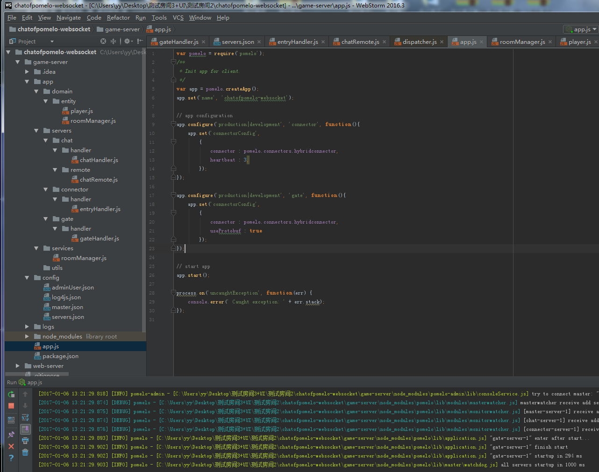

## 3 用户操作流程
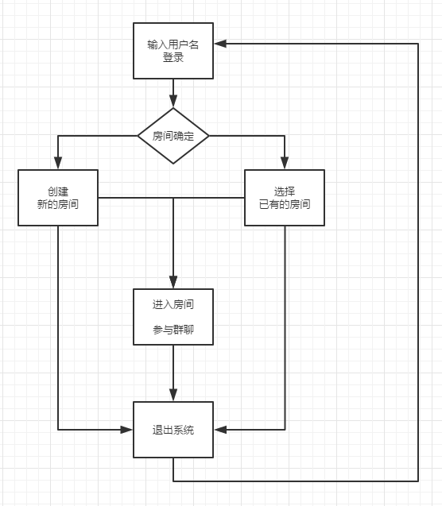

### 3.1 多用户的登录，房间创建

* 第一个用户创建房间

* 第二次用户创建房间

* 第三次用户创建房间
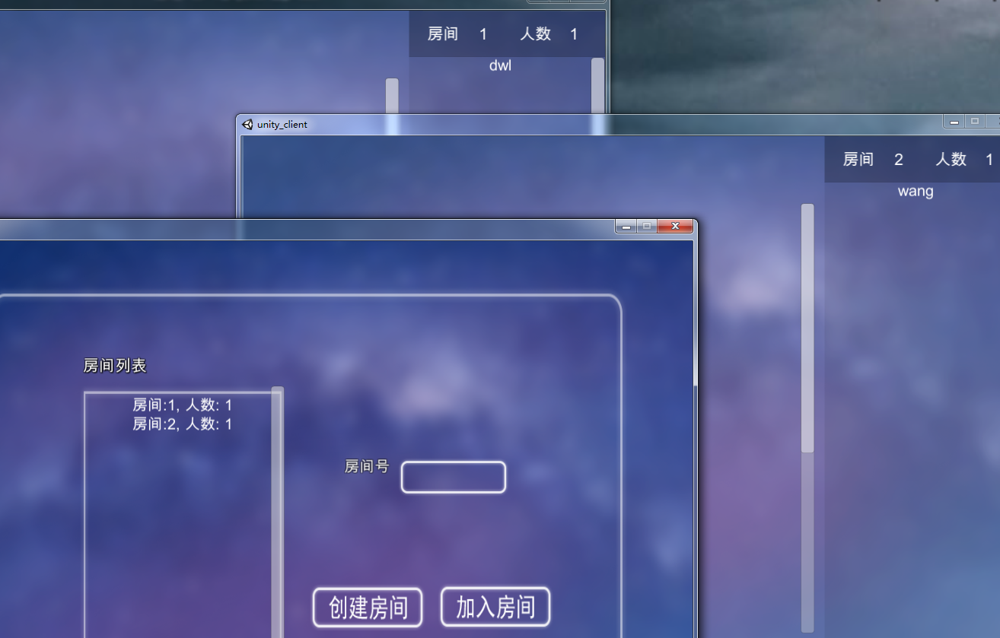

* 第3个用户选择前两个中的一个房间(多人在同一房间）

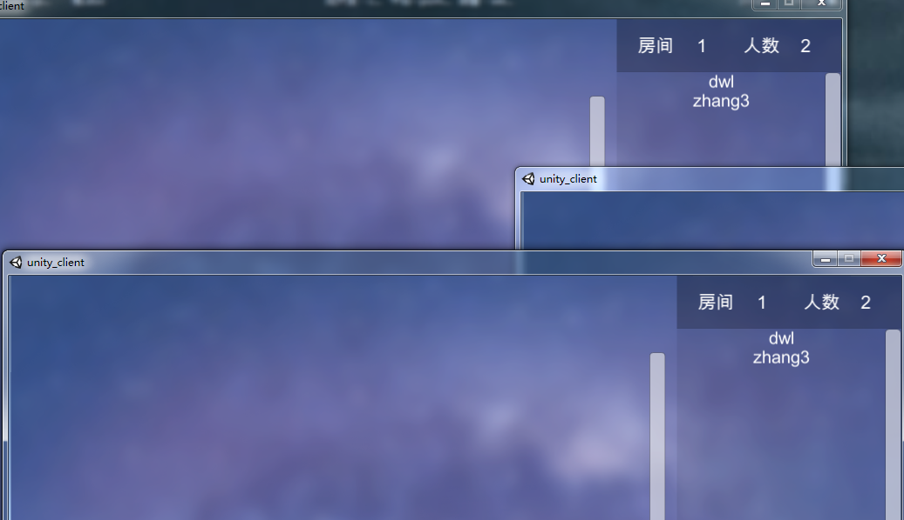

## 3.2 房间创建和选择和错误处理

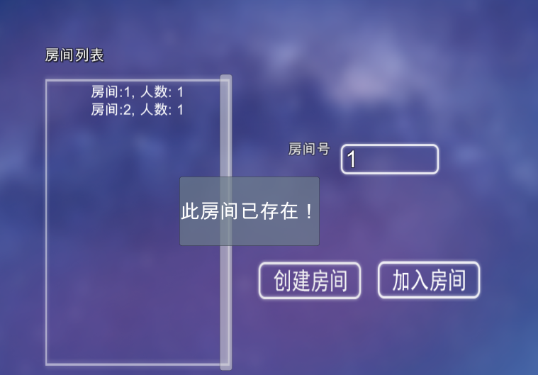

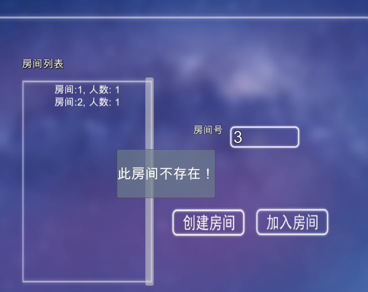

## 3.3 多人聊天

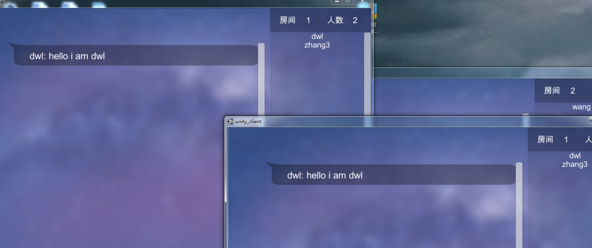

## 3.4 某个聊天用户离开，第4个用户登录

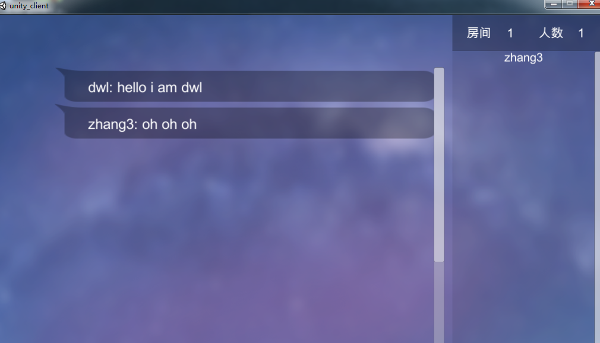

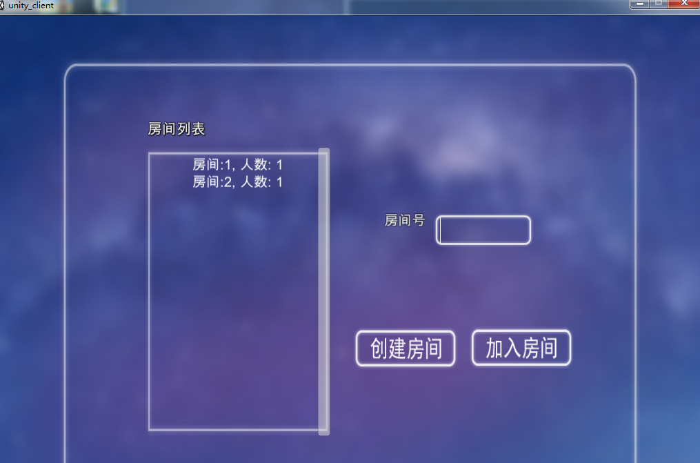

## 3.5 第4个用户登录进入2号房间参与聊天（多个房间 群聊）

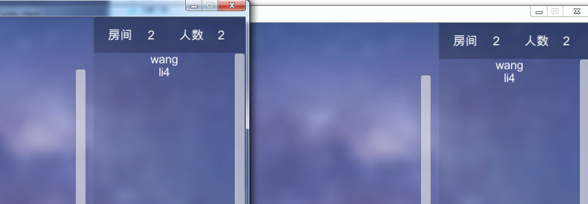

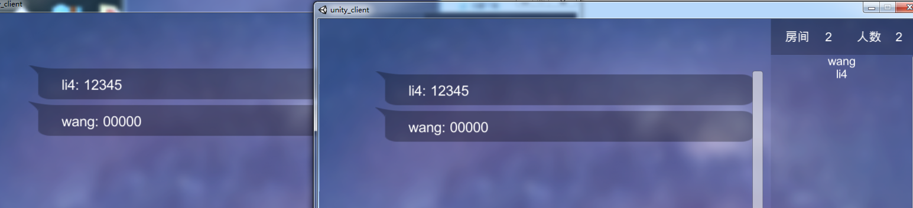

## 3.6 上述用户登录，聊天，退出总结

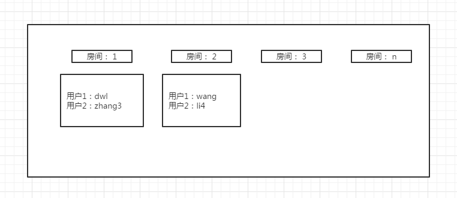

项目扩展
===

* 基于长，实时连接的房间式群聊，可以设计成一个游戏大厅模式，进一步构成多人在线联机游戏

例如，QQ斗地主，QQ象棋，LOL

开发成员及其github主页
===

* 陈艳蕾

https://github.com/lilysara

* 丁文龙

https://github.com/doctording

* 王晓瑶

https://github.com/wxy8961230

* 桂春帅

https://github.com/alex4gcs